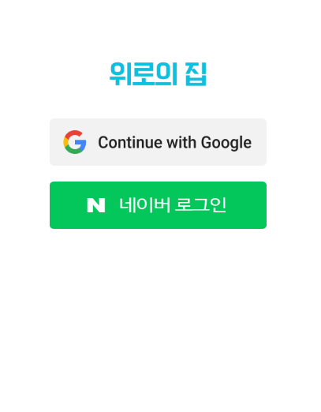
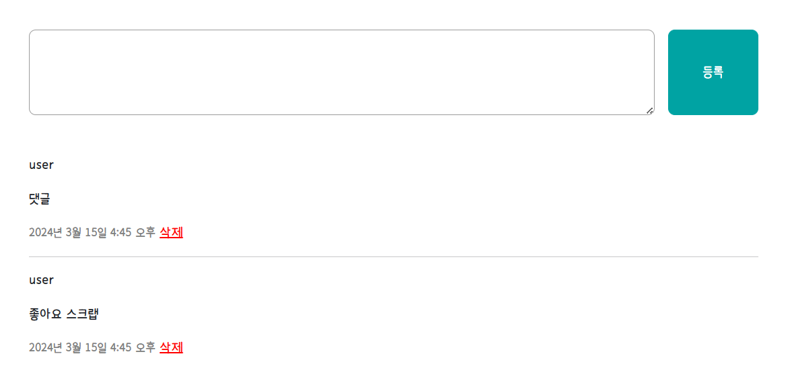
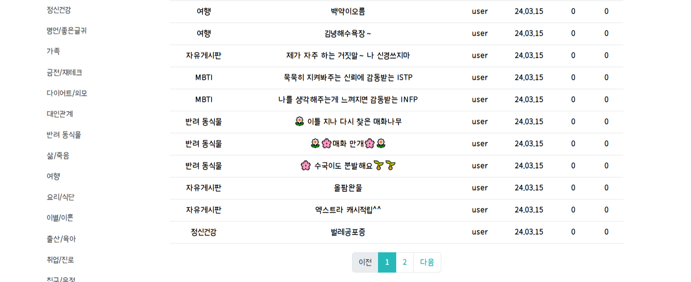
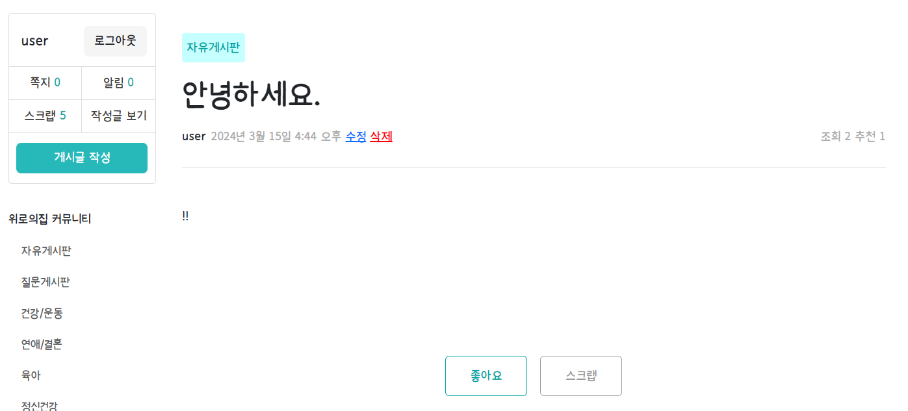

# 개인 프로젝트
심리상담/고민상담 커뮤니티

## 🤙 커밋 메시지 규칙

FEAT : 새로운 기능의 추가 
FIX: 버그 수정 
DOCS: 문서 수정 
STYLE: 스타일 관련 기능(코드 포맷팅, 세미콜론 누락, 코드 자체의 변경이 없는 경우) 
REFACTOR: 코드 리펙토링 
TEST: 테스트 코트, 리펙토링 테스트 코드 추가 
CHORE: 빌드 업무 수정, 패키지 매니저 수정(ex .gitignore 수정 같은 경우) 

## 🚩 프로젝트 목적
누군가에게 털어놓고 싶은 고민거리가 있을 때, 마음껏 털어놓을 수 있는 고민상담 커뮤니티

## 📅 프로젝트 기간 

2024.03.07 ~ 2024.03.20

## 💡 프로젝트 기능

### 1. 소셜 로그인 (구글, 네이버)

### 2. 게시물 작성, 수정, 삭제 ➡ 본인만 가능하도록 권한 부여

- 게시물 작성

- 게시물 수정, 삭제

### 3. 댓글 작성, 삭제 ➡ 본인만 가능하도록 권한 부여

### 4. 페이지네이션, 카테고리 ➡ 카테고리별 게시물 목록 출력
- 페이지네이션

- 카테고리별 게시물

### 5. 스크랩, 좋아요, 조회수
